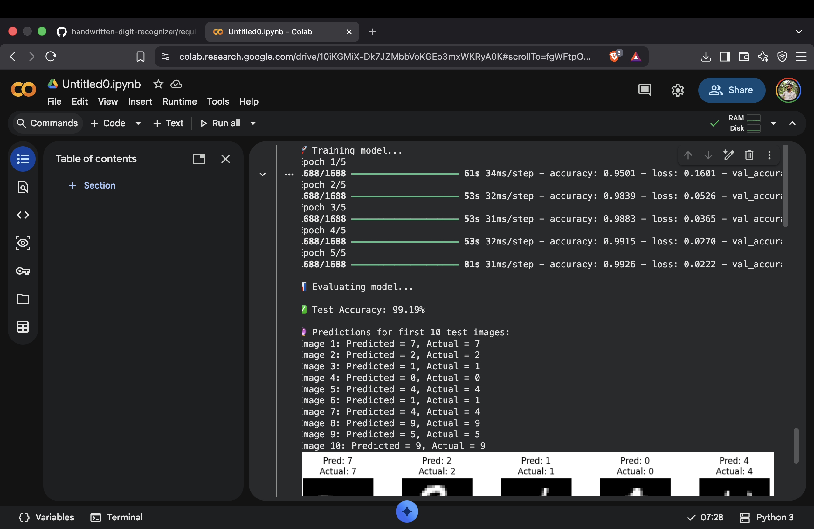
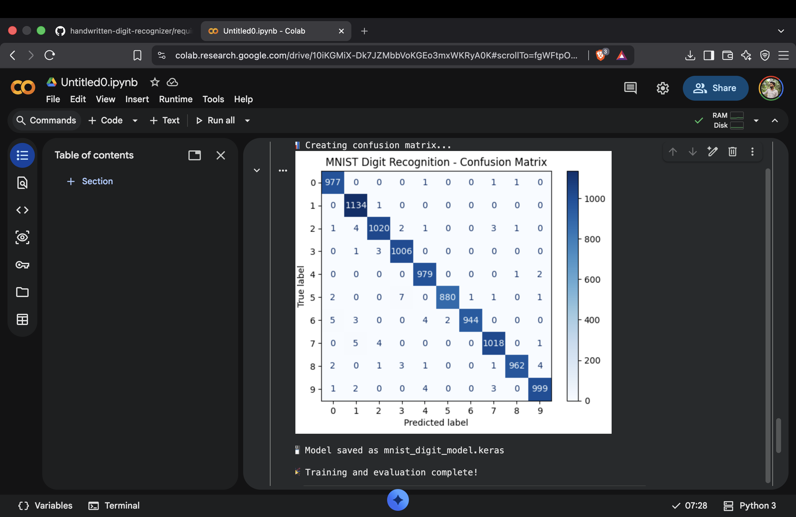

# Handwritten Digit Recognizer

A CNN-based deep learning model that recognizes handwritten digits using the MNIST dataset.

## 📌 About the Project

This project uses a Convolutional Neural Network (CNN) to classify handwritten digits from 0 to 9.

The model is trained on the MNIST dataset and learns visual patterns from 28×28 pixel grayscale images.

## 🚀 Features

- Loads the MNIST dataset
- Preprocesses and normalizes image data
- Uses a Convolutional Neural Network
- Trains the model using TensorFlow/Keras
- Evaluates model performance on unseen test data
- Predicts handwritten digits
- Displays predicted vs actual digits
- Saves the trained model

## 🛠️ Technologies Used

- Python
- TensorFlow
- Keras
- NumPy
- Matplotlib
- CNN (Convolutional Neural Network)
- MNIST Dataset

## 🧠 Model Architecture

The CNN contains:

1. Convolutional Layer — 32 filters
2. Max Pooling Layer
3. Convolutional Layer — 64 filters
4. Max Pooling Layer
5. Flatten Layer
6. Dense Layer — 128 neurons
7. Dropout Layer
8. Output Layer — 10 classes

## 📊 Results

The model was trained for 5 epochs on the MNIST dataset.

### Test Performance

_**Test Accuracy: 99.19%**_
_**Task:**Handwritten digit classification
_**Classes:**10(digits 0-9)
_**Image Size:**20 x 20 pixels
The confusion matrix shows that the model perform very well across all 10 digit classes.

## Model Output



### Confusion Matrix



The model successfully classified handwritten digits from the MNIST test dataset.

## 🔮 Example Predictions

The model correctly predicted the first 10 test images:

| Image | Predicted | Actual |
|---|---:|---:|
| 1 | 7 | 7 |
| 2 | 2 | 2 |
| 3 | 1 | 1 |
| 4 | 0 | 0 |
| 5 | 4 | 4 |
| 6 | 1 | 1 |
| 7 | 4 | 4 |
| 8 | 9 | 9 |
| 9 | 5 | 5 |
| 10 | 9 | 9 |

## ▶️ How to Run

Install the required libraries:

```bash
pip install tensorflow matplotlib
